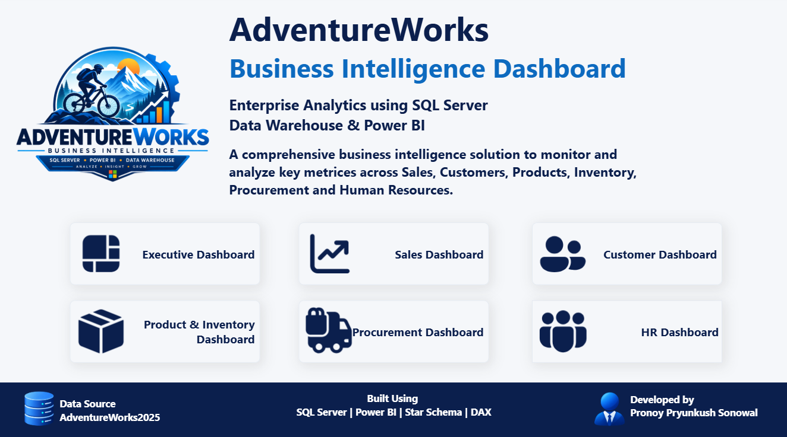
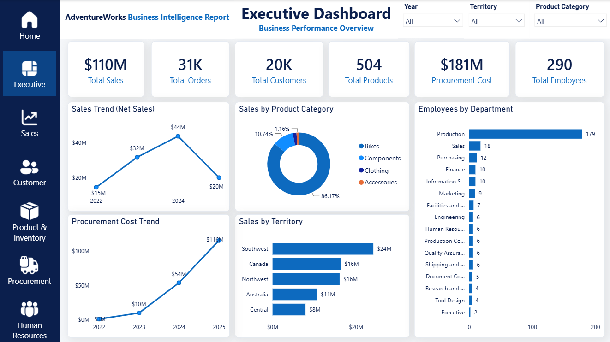
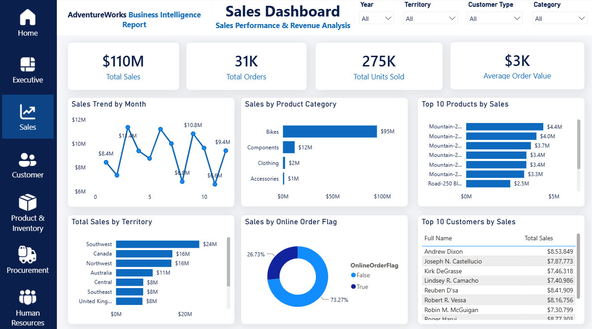
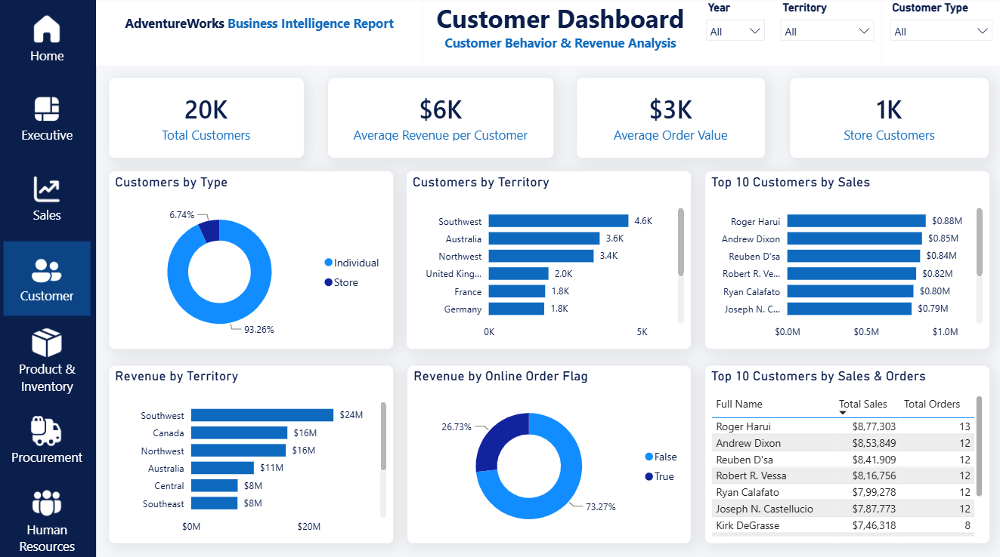
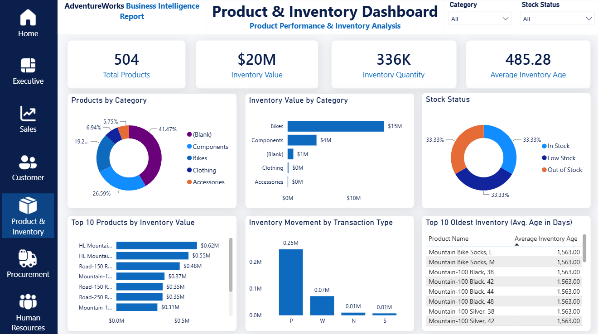
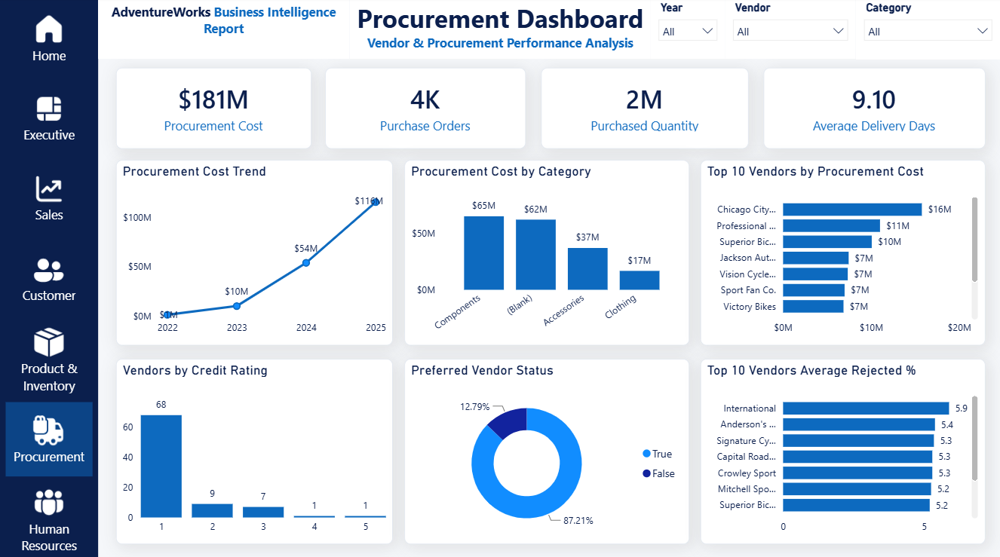
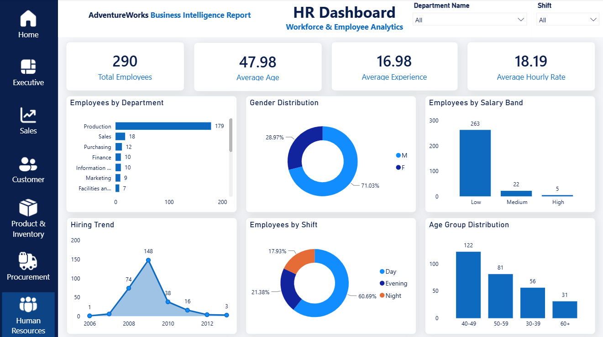

# AdventureWorks SQL Data Warehouse & Business Intelligence Project

Welcome to the **AdventureWorks SQL Data Warehouse & Business Intelligence Project** repository! 🚀

This project demonstrates a complete end-to-end data warehousing and
business intelligence solution, starting from the AdventureWorks2025
operational database and progressing through data engineering, data
transformation, analytical modeling, exploratory data analysis, and
interactive Power BI dashboards.

The project follows industry-oriented practices for building a SQL Server
Data Warehouse using **Bronze, Silver, and Gold layers**, followed by
business analysis and reporting.

---

## 🏗️ Data Architecture

The data architecture for this project follows Medallion Architecture
**Bronze**, **Silver**, and **Gold** layers:


1. **Bronze Layer**: Stores raw data as-it-is from the source systems. Data is ingested from AdventureWorks2025 Database into SQL Server Database.
2. **Silver Layer**: This layer includes data cleansing, standardization, and normalization processes to prepare data for analysis.
3. **Gold Layer**: Houses business-ready data modeled into a star schema required for reporting and analytics.


---

## 📖 Project Overview

This project involves:

1. **Data Architecture**: Designing a modern SQL Server Data Warehouse using
   Bronze, Silver, and Gold layers.

2. **Data Engineering**: Loading and transforming data from the
   AdventureWorks2025 OLTP database.

3. **ETL / ELT Pipelines**: Extracting, loading, cleaning, integrating, and
   transforming data across the warehouse layers.

4. **Data Modeling**: Designing business-oriented entities and a Gold-layer
   star schema consisting of dimension and fact views.

5. **Data Quality & Testing**: Performing data validation and testing across
   the Silver and Gold layers.

6. **Exploratory Data Analysis**: Using SQL to analyze Sales, Customer,
   Product & Inventory, Procurement, and HR business domains.

7. **Business Intelligence**: Developing an interactive Power BI report with
   multiple analytical dashboards.

8. **Business Insights**: Translating analytical findings into actionable
   business recommendations.

🎯 This repository demonstrates practical skills in:

- SQL Development
- SQL Server
- Data Warehousing
- Data Engineering
- ETL / ELT
- Medallion Architecture
- Data Cleaning
- Data Transformation
- Data Integration
- Data Modeling
- Dimensional Modeling
- Star Schema
- Data Quality Testing
- Exploratory Data Analysis
- DAX
- Power BI
- Business Intelligence
- Data Visualization
- Business Analysis
- Git & GitHub

---

## 🎯 Business Problem

The AdventureWorks2025 OLTP database contains operational data distributed
across multiple normalized tables.

Although the OLTP database is suitable for transactional operations, it is
not optimized for analytical reporting and business decision-making.

The objective of this project is to build a centralized analytical data
warehouse that allows business stakeholders to analyze:

### Sales

- Sales performance over time
- Revenue by product and category
- Revenue by sales territory
- Top-performing customers
- Online versus non-online sales

### Customer

- Customer base and segmentation
- Customer distribution by territory
- Customer revenue contribution
- High-value customers
- Customer purchasing behavior

### Product & Inventory

- Product performance
- Product category performance
- Inventory value
- Stock status
- Inventory movement
- Aging inventory

### Procurement

- Procurement spending
- Procurement trends
- Vendor performance
- Supplier delivery efficiency
- Supplier rejection rates
- Preferred vendor usage

### Human Resources

- Workforce distribution
- Department composition
- Employee demographics
- Salary bands
- Hiring trends
- Shift distribution

---

## 📊 Project Scope

The project uses data from the **AdventureWorks2025 OLTP database** and
covers five major business domains:

- Sales
- Customer
- Product & Inventory
- Procurement
- Human Resources

The source database contains data from the following major areas:

### Sales

- Sales Orders
- Customers
- Sales Territories
- Promotions
- Stores

### Person

- Persons
- Addresses
- State/Province
- Countries
- Email Addresses
- Phone Numbers

### Production

- Products
- Product Categories
- Product Subcategories
- Product Inventory
- Locations
- Transaction History
- Product Cost History
- Product List Price History

### Purchasing

- Purchase Orders
- Vendors
- Product Vendors
- Ship Methods

### Human Resources

- Employees
- Departments
- Employee Department History
- Employee Pay History
- Shifts

---

# 🥉 Bronze Layer

The Bronze Layer is the raw data layer of the warehouse.

Data from the AdventureWorks2025 OLTP database is loaded into Bronze tables
with minimal transformation.

### Main Objectives

- Load source data into the warehouse
- Preserve source information
- Maintain source-level structure where appropriate
- Provide a reliable raw layer for downstream processing

The Bronze layer acts as the foundation for the Silver layer.

---

# 🥈 Silver Layer

The Silver Layer is responsible for cleaning, standardizing, integrating,
and transforming the Bronze data.

Related source tables are combined into business-oriented entities to make
the data easier to use for downstream analytics.

### Main Objectives

- Data cleansing
- Data standardization
- Data integration
- Data transformation
- Business entity creation
- Derived business attributes
- Preparation for analytical modeling

## Silver Business Entities

The project creates the following major Silver entities:

| Silver Table | Business Purpose |
|---|---|
| `silver.Customer` | Customer information and customer attributes |
| `silver.Product` | Product, category, and product attributes |
| `silver.Employee` | Employee, department, shift, and HR information |
| `silver.Vendor` | Vendor and supplier information |
| `silver.Location` | Address and geographic information |
| `silver.SalesTerritory` | Sales territory information |
| `silver.Promotion` | Promotion and discount information |
| `silver.Sales` | Integrated sales transactions |
| `silver.Purchase` | Integrated purchasing transactions |
| `silver.Inventory` | Inventory and inventory transaction information |

---

# 🥇 Gold Layer

The Gold Layer contains **business-ready analytical views** designed for
reporting, business intelligence, and analytical queries.

The Gold layer follows a **Star Schema** approach consisting of dimension
and fact views. Dimension views provide descriptive business attributes,
while fact views contain transactional data and business measures.

## Gold Dimension Views

The Gold layer contains the following dimension views:

| Dimension View             | Business Purpose                                                                                                    |
| -------------------------- | ------------------------------------------------------------------------------------------------------------------- |
| `gold.dim_customer`        | Contains customer information, customer type, contact details, store information, and customer attributes.          |
| `gold.dim_product`         | Contains product information, product categories, pricing, cost, product status, and product attributes.            |
| `gold.dim_employee`        | Contains employee information, department, shift, employment details, compensation, and workforce attributes.       |
| `gold.dim_vendor`          | Contains supplier information, vendor status, credit rating, pricing, lead time, and vendor performance attributes. |
| `gold.dim_location`        | Contains address, city, state, country, postal code, territory, and geographic information.                         |
| `gold.dim_sales_territory` | Contains sales territory information, regional sales performance, costs, profit, and growth metrics.                |
| `gold.dim_promotion`       | Contains promotion details, discounts, promotion type, category, validity period, and promotion status.             |

### Gold Dimension Views

```text
gold.dim_customer
gold.dim_product
gold.dim_employee
gold.dim_vendor
gold.dim_location
gold.dim_sales_territory
gold.dim_promotion
```

## Gold Fact Views

The Gold layer contains the following fact views:

| Fact View              | Business Purpose                                                                                                      |
| ---------------------- | --------------------------------------------------------------------------------------------------------------------- |
| `gold.fact_sales`      | Contains sales transactions, order quantities, prices, discounts, revenue, shipping information, and sales measures. |
| `gold.fact_purchase`   | Contains purchase transactions, quantities, costs, receiving information, delivery performance, and procurement measures. |
| `gold.fact_inventory`  | Contains inventory transactions, product quantities, costs, inventory value, inventory age, and stock status.        |

### Gold Fact Views

```text
gold.fact_sales
gold.fact_purchase
gold.fact_inventory
```

---

# 🔄 ETL / Data Loading

The project uses **SQL Server and T-SQL** to load, clean, transform, and
integrate data through the Bronze, Silver, and Gold layers.

The overall data flow is:

```text
AdventureWorks2025
        |
        v
   Bronze Layer
        |
        v
   Silver Layer
        |
        v
    Gold Layer
        |
        v
 SQL Analytics / EDA
        |
        v
    Power BI
```
---

# 🧪 Data Quality & Testing

Data quality testing was performed on the **Silver and Gold layers** to
ensure that the transformed and business-ready data is reliable and
suitable for analytical reporting.

The testing process validates the quality and consistency of data before it
is used for Exploratory Data Analysis and Power BI reporting.

## Silver Layer Testing

The Silver layer quality checks focus on validating the cleaned and
transformed business entities.

The checks include:

- Row count validation
- NULL value checks
- Duplicate record checks
- Business key validation
- Data consistency checks
- Invalid value checks
- Data completeness checks

The Silver layer testing script is available at:

```text
tests/quality_checks_silver.sql

## Gold Layer Testing
The Gold layer quality checks focus on validating the business-ready
dimension and fact views used for analytics and reporting.

The checks include:

- Row count validation
- NULL value checks
- Duplicate record checks
- Dimension key validation
- Fact data validation
- Referential integrity checks
- Business key validation
- Data consistency checks
- Fact and dimension relationship checks

The Gold layer testing script is available at:

```text
tests/quality_checks_gold.sql
```
---

# 🔍 Exploratory Data Analysis

Exploratory Data Analysis (EDA) was performed using **SQL Server** on the
business-ready Gold layer to understand business performance, identify
important trends and patterns, and determine the KPIs required for the
Power BI dashboards.

The analysis covers five major business domains:

## 1. Sales Analytics

The Sales EDA analyzes:

- Sales revenue and sales trends
- Total orders and units sold
- Sales performance by year and month
- Top-performing products
- Top-performing customers
- Sales performance by territory
- Online vs non-online sales
- Discounts and profitability
- Shipping performance

The analysis helps identify major revenue drivers, high-performing products
and customers, regional performance, and sales trends.

---

## 2. Customer Analytics

The Customer EDA analyzes:

- Total customer base
- Customer type distribution
- Customers by sales territory
- Top customers by revenue
- Low-value customers
- Average revenue per customer
- Average orders per customer
- Average order value by customer type
- Customer revenue by territory
- Customer purchase quantity
- Customer discount behavior
- Online vs offline customers

The analysis helps identify high-value customers, customer segments,
purchasing behavior, and regional customer contribution.

---

## 3. Product & Inventory Analytics

The Product & Inventory EDA analyzes:

- Product catalog
- Product categories and subcategories
- Product pricing and cost
- Product profitability
- Product sales performance
- Inventory quantity
- Inventory value
- Stock status
- Inventory aging
- Inventory movement
- High-performing and low-performing products

The analysis helps identify important products, profitable product
categories, inventory levels, and potential inventory optimization
opportunities.

---

## 4. Procurement Analytics

The Procurement EDA analyzes:

- Total procurement cost
- Purchase orders
- Purchased quantity
- Procurement trends
- Procurement cost by vendor
- Procurement cost by product category
- Top purchased products
- Vendor lead time
- Vendor credit ratings
- Preferred vendors
- Delivery performance
- Receiving performance
- Vendor rejection rates
- Employee procurement performance
- Procurement by department
- Vendor status

The analysis helps evaluate supplier performance, procurement spending,
delivery efficiency, receiving quality, and potential supplier risks.

---

## 5. HR Analytics

The HR EDA analyzes:

- Total employees
- Employee distribution by department
- Employee distribution by gender
- Employee age distribution
- Employee experience
- Salary bands
- Job titles
- Shift distribution
- Hiring trends
- Employment status
- Workforce characteristics

The analysis helps understand workforce composition, employee distribution,
salary structure, and hiring patterns.

---

## 📊 EDA Outcomes

The EDA was used to identify:

- Key business KPIs
- Important business dimensions
- Revenue and cost drivers
- Customer segments
- Product performance indicators
- Inventory performance indicators
- Vendor performance indicators
- Workforce metrics
- Business trends and patterns

The findings from the EDA were then used to design the Power BI dashboards
and determine the KPIs and visualizations required for each business domain.

### EDA SQL Script

The complete SQL-based EDA script is available at:

```text
scripts/analysis/exploratory_data_analysis.sql
```
### EDA Documentation

The documented EDA results and findings are available at:

```text
docs/eda.md
```

---

# 📊 Power BI Report

The final Business Intelligence solution was developed using **Microsoft
Power BI** to provide interactive dashboards for business stakeholders.

The report contains **7 pages**, covering the major business areas of the
Data Warehouse:

1. **Home** – Provides navigation to the different dashboards and introduces
   the project.

2. **Executive Dashboard** – Provides a high-level overview of overall
   business performance using key business KPIs.

3. **Sales Dashboard** – Analyzes revenue, orders, products, customers,
   territories, and sales channels.

4. **Customer Dashboard** – Analyzes customer segments, customer value,
   customer distribution, and purchasing behavior.

5. **Product & Inventory Dashboard** – Analyzes product performance,
   inventory value, stock status, inventory quantity, and inventory aging.

6. **Procurement Dashboard** – Analyzes procurement spending, vendors,
   purchasing trends, delivery performance, and supplier quality.

7. **HR Dashboard** – Analyzes employee distribution, departments, salary
   bands, workforce characteristics, and hiring trends.

The report uses the **Gold layer of the SQL Server Data Warehouse** as the
primary reporting source.

### Power BI Report File

```text
powerbi/
└── AdventureWorks_BI_Report.pbix
```

---
# 🛠️ Technologies Used

| Technology | Purpose |
|---|---|
| **Microsoft SQL Server** | Data Warehouse and database platform |
| **T-SQL** | Data loading, transformation, testing, and analysis |
| **AdventureWorks2025** | Source OLTP database |
| **Microsoft Power BI** | Business Intelligence and dashboard development |
| **DAX** | Power BI measures and calculations |
| **Draw.io** | Data Warehouse architecture, data flow, and data model documentation |
| **Git & GitHub** | Version control and project management |

---

# 🚀 How to Run the Project

Follow the steps below to set up the AdventureWorks Data Warehouse and
Power BI report.

## Step 1 — Download AdventureWorks2025

Download the AdventureWorks2025 database from Microsoft's official
documentation.

```text
datasets/README.md
```

**Purpose:** Obtain the source database used by the project.

---

## Step 2 — Restore the Database

Restore `AdventureWorks2025.bak` using **SQL Server Management Studio
(SSMS)**.

**Purpose:** Make the AdventureWorks2025 source database available in
SQL Server.

---

## Step 3 — Initialize the Data Warehouse

Run:

```text
scripts/init_database.sql
```

**Purpose:** Create the Data Warehouse database and required schemas.

--- 

## Step 4 — Create and Load the Bronze Layer

Run the following scripts in SQL Server Management Studio (SSMS):

```text
scripts/bronze/ddl_bronze.sql
scripts/bronze/procedure_load_bronze.sql
```

**Purpose:** Create the Bronze tables and load the source data into the raw
layer.

---

## Step 5 — Create and Load the Silver Layer

Run the following SQL scripts in order:

```text
scripts/silver/ddl_silver.sql
scripts/silver/procedure_load_silver.sql
```

**Purpose:** Clean, standardize, integrate, and transform the Bronze layer
data into business-oriented Silver tables.

---

## Step 6 — Create the Gold Layer

Run:

```text
scripts/gold/ddl_gold.sql
```

**Purpose:** Create the business-ready Gold dimension and fact views used for
analytics and Power BI reporting.

---

## Step 7 — Run Data Quality Checks

Run the following SQL scripts:

```text
tests/quality_checks_silver.sql
tests/quality_checks_gold.sql
```

**Purpose:** Validate the quality, consistency, and reliability of the
transformed data before using it for analysis and reporting.

---

## Step 8 — Run Exploratory Data Analysis

Run the following SQL script:

```text
scripts/analysis/exploratory_data_analysis.sql
```

**Purpose:** Analyze the Gold layer to identify business trends, KPIs,
patterns, and insights across Sales, Customer, Product & Inventory,
Procurement, and HR.

---

## Step 9 — Open the Power BI Report

Open the Power BI report:

```text
powerbi/AdventureWorks_BI_Report.pbix
```

**Purpose:** Connect the report to the SQL Server Data Warehouse, refresh the
data, and view the final interactive dashboards.

---

# 📸 Power BI Dashboard Screenshots

The Power BI report contains the following dashboards:

### 🏠 Home

<br><br>



<br><br><br>

---

### 📊 Executive Dashboard

<br><br>



<br><br><br>

---

### 💰 Sales Dashboard

<br><br>



<br><br><br>

---

### 👥 Customer Dashboard

<br><br>



<br><br><br>

---

### 📦 Product & Inventory Dashboard

<br><br>



<br><br><br>

---

### 🛒 Procurement Dashboard

<br><br>



<br><br><br>

---

### 👨‍💼 HR Dashboard

<br><br>



<br><br><br>

---

# 📂 Repository Structure

```text
sql-data-warehouse-project/
│
├── datasets/                                      # Dataset information
│   └── README.md                                  # AdventureWorks2025 dataset and download instructions
│
├── docs/                                          # Project documentation and analysis
│   ├── business_insights.md                       # Business insights and recommendations
│   ├── data_catalog.md                            # Data catalog and business descriptions
│   ├── data_flow.png                              # Data flow diagram
│   ├── data_model_1.png                           # Sales Data Mart model
│   ├── data_model_2.png                           # Customer Data Mart model
│   ├── data_model_3.png                           # Product & Inventory Data Mart model
│   ├── data_model_4.png                           # Purchase Data Mart model
│   ├── data_model_5.png                           # HR Data Mart model
│   ├── data_warehouse_architecture.png            # Data warehouse architecture
│   ├── eda.md                                     # Exploratory Data Analysis and findings
│   └── naming_conventions.md                      # Naming conventions used in the project
│
├── powerbi/                                       # Power BI Business Intelligence report
│   ├── AdventureWorks_BI_Report.pbix              # Final Power BI report
│   └── images/                                    # Power BI dashboard screenshots
│       ├── home.png                               # Home page
│       ├── executive_dashboard.png                # Executive Dashboard
│       ├── sales_dashboard.png                   # Sales Dashboard
│       ├── customer_dashboard.png                # Customer Dashboard
│       ├── product_inventory_dashboard.png       # Product & Inventory Dashboard
│       ├── procurement_dashboard.png              # Procurement Dashboard
│       └── hr_dashboard.png                      # HR Dashboard
│
├── scripts/                                       # SQL Server data warehouse scripts
│   ├── init_database.sql                          # Initializes the Data Warehouse database and schemas
│   │
│   ├── bronze/                                    # Bronze layer scripts
│   │   ├── ddl_bronze.sql                         # Creates Bronze layer tables
│   │   └── procedure_load_bronze.sql              # Loads source data into Bronze layer
│   │
│   ├── silver/                                    # Silver layer scripts
│   │   ├── ddl_silver.sql                         # Creates Silver layer tables
│   │   └── procedure_load_silver.sql              # Cleans, transforms, and loads Silver data
│   │
│   ├── gold/                                      # Gold layer scripts
│   │   └── ddl_gold.sql                            # Creates Gold dimension and fact views
│   │
│   └── analysis/                                  # SQL-based analytics
│       └── exploratory_data_analysis.sql          # Exploratory Data Analysis queries
│
├── tests/                                         # Data quality and validation scripts
│   ├── quality_checks_gold.sql                    # Gold layer quality checks
│   └── quality_checks_silver.sql                  # Silver layer quality checks
│
├── README.md                                      # Project overview and documentation
└── LICENSE                                        # Repository license
```
---

## 🛡️ License

This project is licensed under the [MIT License](LICENSE). You are free to use, modify, and share this project with proper attribution.

---

## 👤 About Me

Hi! I'm **Pronoy Pryunkush Sonowal**, a data enthusiast focused on building practical
projects in **Data Analytics, Data Engineering, SQL, Data Warehousing, and
Business Intelligence**.

This project was developed to demonstrate an end-to-end data analytics
workflow, from an operational database through data warehousing,
transformation, exploratory analysis, and Power BI reporting.
