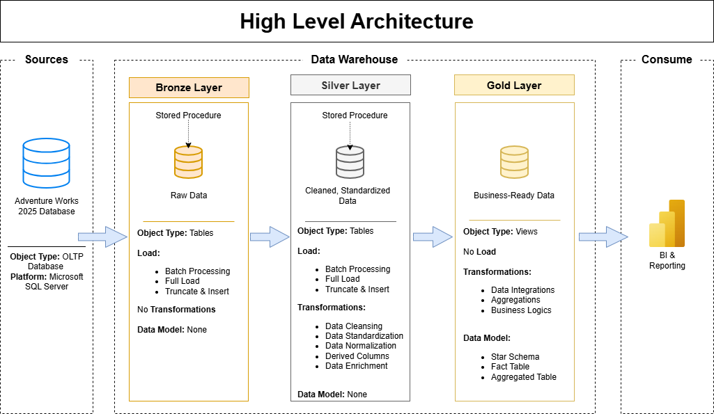

# AdventureWorks SQL Data Warehouse & Business Intelligence Project

Welcome to the **AdventureWorks SQL Data Warehouse & Business Intelligence Project** repository! 🚀

This project demonstrates a complete end-to-end data warehousing and
business intelligence solution, starting from the AdventureWorks2025
operational database and progressing through data engineering, data
transformation, analytical modeling, exploratory data analysis, and
interactive Power BI dashboards.

The project follows industry-oriented practices for building a SQL Server
Data Warehouse using **Bronze, Silver, and Gold layers**, followed by
business analysis and reporting.

---

## 🏗️ Data Architecture

The data architecture for this project follows Medallion Architecture
**Bronze**, **Silver**, and **Gold** layers:


1. **Bronze Layer**: Stores raw data as-it-is from the source systems. Data is ingested from AdventureWorks2025 Database into SQL Server Database.
2. **Silver Layer**: This layer includes data cleansing, standardization, and normalization processes to prepare data for analysis.
3. **Gold Layer**: Houses business-ready data modeled into a star schema required for reporting and analytics.


---

## 📖 Project Overview

This project involves:

1. **Data Architecture**: Designing a modern SQL Server Data Warehouse using
   Bronze, Silver, and Gold layers.

2. **Data Engineering**: Loading and transforming data from the
   AdventureWorks2025 OLTP database.

3. **ETL / ELT Pipelines**: Extracting, loading, cleaning, integrating, and
   transforming data across the warehouse layers.

4. **Data Modeling**: Designing business-oriented entities and a Gold-layer
   star schema consisting of dimension and fact views.

5. **Data Quality & Testing**: Performing data validation and testing across
   the Silver and Gold layers.

6. **Exploratory Data Analysis**: Using SQL to analyze Sales, Customer,
   Product & Inventory, Procurement, and HR business domains.

7. **Business Intelligence**: Developing an interactive Power BI report with
   multiple analytical dashboards.

8. **Business Insights**: Translating analytical findings into actionable
   business recommendations.

🎯 This repository demonstrates practical skills in:

- SQL Development
- SQL Server
- Data Warehousing
- Data Engineering
- ETL / ELT
- Medallion Architecture
- Data Cleaning
- Data Transformation
- Data Integration
- Data Modeling
- Dimensional Modeling
- Star Schema
- Data Quality Testing
- Exploratory Data Analysis
- DAX
- Power BI
- Business Intelligence
- Data Visualization
- Business Analysis
- Git & GitHub

---

## 🎯 Business Problem

The AdventureWorks2025 OLTP database contains operational data distributed
across multiple normalized tables.

Although the OLTP database is suitable for transactional operations, it is
not optimized for analytical reporting and business decision-making.

The objective of this project is to build a centralized analytical data
warehouse that allows business stakeholders to analyze:

### Sales

- Sales performance over time
- Revenue by product and category
- Revenue by sales territory
- Top-performing customers
- Online versus non-online sales

### Customer

- Customer base and segmentation
- Customer distribution by territory
- Customer revenue contribution
- High-value customers
- Customer purchasing behavior

### Product & Inventory

- Product performance
- Product category performance
- Inventory value
- Stock status
- Inventory movement
- Aging inventory

### Procurement

- Procurement spending
- Procurement trends
- Vendor performance
- Supplier delivery efficiency
- Supplier rejection rates
- Preferred vendor usage

### Human Resources

- Workforce distribution
- Department composition
- Employee demographics
- Salary bands
- Hiring trends
- Shift distribution

---

## 📊 Project Scope

The project uses data from the **AdventureWorks2025 OLTP database** and
covers five major business domains:

- Sales
- Customer
- Product & Inventory
- Procurement
- Human Resources

The source database contains data from the following major areas:

### Sales

- Sales Orders
- Customers
- Sales Territories
- Promotions
- Stores

### Person

- Persons
- Addresses
- State/Province
- Countries
- Email Addresses
- Phone Numbers

### Production

- Products
- Product Categories
- Product Subcategories
- Product Inventory
- Locations
- Transaction History
- Product Cost History
- Product List Price History

### Purchasing

- Purchase Orders
- Vendors
- Product Vendors
- Ship Methods

### Human Resources

- Employees
- Departments
- Employee Department History
- Employee Pay History
- Shifts

---

# 🥉 Bronze Layer

The Bronze Layer is the raw data layer of the warehouse.

Data from the AdventureWorks2025 OLTP database is loaded into Bronze tables
with minimal transformation.

### Main Objectives

- Load source data into the warehouse
- Preserve source information
- Maintain source-level structure where appropriate
- Provide a reliable raw layer for downstream processing

The Bronze layer acts as the foundation for the Silver layer.

---

# 🥈 Silver Layer

The Silver Layer is responsible for cleaning, standardizing, integrating,
and transforming the Bronze data.

Related source tables are combined into business-oriented entities to make
the data easier to use for downstream analytics.

### Main Objectives

- Data cleansing
- Data standardization
- Data integration
- Data transformation
- Business entity creation
- Derived business attributes
- Preparation for analytical modeling

## Silver Business Entities

The project creates the following major Silver entities:

| Silver Table | Business Purpose |
|---|---|
| `silver.Customer` | Customer information and customer attributes |
| `silver.Product` | Product, category, and product attributes |
| `silver.Employee` | Employee, department, shift, and HR information |
| `silver.Vendor` | Vendor and supplier information |
| `silver.Location` | Address and geographic information |
| `silver.SalesTerritory` | Sales territory information |
| `silver.Promotion` | Promotion and discount information |
| `silver.Sales` | Integrated sales transactions |
| `silver.Purchase` | Integrated purchasing transactions |
| `silver.Inventory` | Inventory and inventory transaction information |

---

# 🥇 Gold Layer

The Gold Layer contains **business-ready analytical views** designed for
reporting, business intelligence, and analytical queries.

The Gold layer follows a **Star Schema** approach consisting of dimension
and fact views. Dimension views provide descriptive business attributes,
while fact views contain transactional data and business measures.

## Gold Dimension Views

The Gold layer contains the following dimension views:

| Dimension View             | Business Purpose                                                                                                    |
| -------------------------- | ------------------------------------------------------------------------------------------------------------------- |
| `gold.dim_customer`        | Contains customer information, customer type, contact details, store information, and customer attributes.          |
| `gold.dim_product`         | Contains product information, product categories, pricing, cost, product status, and product attributes.            |
| `gold.dim_employee`        | Contains employee information, department, shift, employment details, compensation, and workforce attributes.       |
| `gold.dim_vendor`          | Contains supplier information, vendor status, credit rating, pricing, lead time, and vendor performance attributes. |
| `gold.dim_location`        | Contains address, city, state, country, postal code, territory, and geographic information.                         |
| `gold.dim_sales_territory` | Contains sales territory information, regional sales performance, costs, profit, and growth metrics.                |
| `gold.dim_promotion`       | Contains promotion details, discounts, promotion type, category, validity period, and promotion status.             |

### Gold Dimension Views

```text
gold.dim_customer
gold.dim_product
gold.dim_employee
gold.dim_vendor
gold.dim_location
gold.dim_sales_territory
gold.dim_promotion
```

## Gold Fact Views

The Gold layer contains the following fact views:

| Fact View              | Business Purpose                                                                                                      |
| ---------------------- | --------------------------------------------------------------------------------------------------------------------- |
| `gold.fact_sales`      | Contains sales transactions, order quantities, prices, discounts, revenue, shipping information, and sales measures. |
| `gold.fact_purchase`   | Contains purchase transactions, quantities, costs, receiving information, delivery performance, and procurement measures. |
| `gold.fact_inventory`  | Contains inventory transactions, product quantities, costs, inventory value, inventory age, and stock status.        |

### Gold Fact Views

```text
gold.fact_sales
gold.fact_purchase
gold.fact_inventory
```

---

## 📂 Repository Structure

```text
sql-data-warehouse-project/
│
├── datasets/                                      # Dataset information
│   └── README.md                                  # AdventureWorks2025 dataset and download instructions
│
├── docs/                                          # Project documentation and analysis
│   ├── business_insights.md                       # Business insights and recommendations
│   ├── data_catalog.md                            # Data catalog and business descriptions
│   ├── data_flow.png                              # Data flow diagram
│   ├── data_model_1.png                           # Sales Data Mart model
│   ├── data_model_2.png                           # Customer Data Mart model
│   ├── data_model_3.png                           # Product & Inventory Data Mart model
│   ├── data_model_4.png                           # Purchase Data Mart model
│   ├── data_model_5.png                           # HR Data Mart model
│   ├── data_warehouse_architecture.png            # Data warehouse architecture
│   ├── eda.md                                     # Exploratory Data Analysis and findings
│   └── naming_conventions.md                      # Naming conventions used in the project
│
├── powerbi/                                       # Power BI Business Intelligence report
│   ├── AdventureWorks_BI_Report.pbix              # Final Power BI report
│   └── images/                                    # Power BI dashboard screenshots
│       ├── home.png                               # Home page
│       ├── executive_dashboard.png                # Executive Dashboard
│       ├── sales_dashboard.png                   # Sales Dashboard
│       ├── customer_dashboard.png                # Customer Dashboard
│       ├── product_inventory_dashboard.png       # Product & Inventory Dashboard
│       ├── procurement_dashboard.png              # Procurement Dashboard
│       └── hr_dashboard.png                      # HR Dashboard
│
├── scripts/                                       # SQL Server data warehouse scripts
│   ├── init_database.sql                          # Initializes the Data Warehouse database and schemas
│   │
│   ├── bronze/                                    # Bronze layer scripts
│   │   ├── ddl_bronze.sql                         # Creates Bronze layer tables
│   │   └── procedure_load_bronze.sql              # Loads source data into Bronze layer
│   │
│   ├── silver/                                    # Silver layer scripts
│   │   ├── ddl_silver.sql                         # Creates Silver layer tables
│   │   └── procedure_load_silver.sql              # Cleans, transforms, and loads Silver data
│   │
│   ├── gold/                                      # Gold layer scripts
│   │   └── ddl_gold.sql                            # Creates Gold dimension and fact views
│   │
│   └── analysis/                                  # SQL-based analytics
│       └── exploratory_data_analysis.sql          # Exploratory Data Analysis queries
│
├── tests/                                         # Data quality and validation scripts
│   ├── quality_checks_gold.sql                    # Gold layer quality checks
│   └── quality_checks_silver.sql                  # Silver layer quality checks
│
├── README.md                                      # Project overview and documentation
└── LICENSE                                        # Repository license
```
